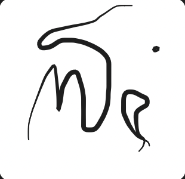

<div align="center">



# enprompt

### Write, dictate, and draw — from one key.

**enprompt** is a free, menu-bar writing assistant for macOS that turns your <kbd>⌥ Option</kbd> key into a
wand. Triple the speed of your typing, dictate with your voice, and turn anything on your screen into the
perfect prompt — all without ever leaving the app you're working in.

[](https://github.com/aadityakumarsah/enprompt/releases)
[](https://github.com/aadityakumarsah/enprompt/releases)
[](https://github.com/aadityakumarsah/enprompt/releases)
[](https://swift.org)
[](#)

</div>

---

## 🎬 Watch it work

<video src="assets/demo.mp4" controls="controls" style="max-width: 100%; border-radius: 12px; box-shadow: 0 10px 40px rgba(0,0,0,.15)"></video>

*Two minutes, one Option key: expand a rough draft, dictate an idea aloud, and capture a screen region into a finished prompt.*

---

## ✨ What can enprompt do?

enprompt is built around **one gesture language**. Every superpower is bound to the <kbd>⌥</kbd> key, so you
never have to think about shortcuts again — just press Option the way the moment demands.

| Gesture | Superpower | What it does |
| --- | --- | --- |
| <kbd>⌥</kbd> <kbd>⌥</kbd> (double-tap) | **Enhance any text** | Reads the focused text field and expands, shortens, or transforms it with your LLM of choice — then writes the result back *in place*. Type shorthand like `btw the q3 numbers were gr8` and get back a polished sentence. |
| <kbd>⌥</kbd> hold (1.2s) | **Dictate** | A live dictation bar appears under your cursor. Speak — the words are transcribed **on-device** and typed into the field you're focused on. |
| <kbd>⌥</kbd> <kbd>⌥</kbd> <kbd>⌥</kbd> (triple-tap) | **Screen → prompt** | A crosshair lets you circle any region of your screen — an error message, a design, a chart. enprompt turns it into a prompt, you speak or type an instruction, and the answer lands in your text field. |
| <kbd>⌥</kbd> + draw | **Live canvas** | An overlay canvas appears on screen: draw, highlight, or laser-point over anything, perfect for presentations and screen-share annotations. |
| <kbd>⌘Z</kbd> | **Instant undo** | Reverts the last enhancement back to your original text. |
| <kbd>Esc</kbd> | **Dismiss** | Cancels dictation or the capture flow instantly. |

### Prompt-engineer mode 🧠

enprompt treats your text field like an LLM prompt box. You don't have to write full prompts — but when you
do, it understands them:

- **Expand** — `tldr: ship the landing page by friday and add a pricing table` → a complete, structured paragraph.
- **Transform** — `rewrite this as a formal email to my manager` → polite, professional prose, written in place.
- **Shorten** — `cut this to 3 bullet points` → crisp bullets.
- **Any instruction** — `translate to french` · `make this funnier` · `turn this into a twitter thread` — the
  focused text is the input, your words are the instruction, and the LLM does the rest.

> 💡 **Safety guard:** enprompt only ever activates when <kbd>⌥</kbd> is pressed **alone**. If Option is
> combined with another modifier (<kbd>⌥⌘</kbd>, <kbd>⌥⇧</kbd>…), nothing happens — your system shortcuts
> always win.

---

## 🚀 Install

The fastest way — one command, straight from GitHub Releases:

```bash
curl -L -o ~/Downloads/enprompt.dmg https://github.com/aadityakumarsah/enprompt/releases/download/v1.8/enprompt-1.8.dmg && open ~/Downloads/enprompt.dmg
```

1. **Download** — run the command above (or grab the DMG from [Releases](https://github.com/aadityakumarsah/enprompt/releases)).
2. **Install** — drag enprompt into your **Applications** folder and open it.
3. **Grant Accessibility** — System Settings → Privacy & Security → Accessibility. Needed once so enprompt can
   see your keystrokes and focused text field everywhere.

## ⚙️ First-run setup

1. Click the enprompt icon in your menu bar → **Settings…**
2. Pick a provider and paste your API key — it's stored in the **Keychain**, never in a file.
3. Hit **Save**, then **Test connection** — the built-in self-test validates key, provider, and vision in one pass.

| Provider | Key looks like | Notes |
| --- | --- | --- |
| Google Gemini | `AIza…` / `AQ…` | Fast, generous free tier; supports vision capture |
| OpenRouter | `sk-or-v1…` | One key, every model (Claude, GPT, Llama…) |
| Anthropic | `sk-ant-…` | Claude-native, supports vision capture |
| Ollama (local) | type `ollama` | 100% local & private — free forever, works offline |

> 🔒 **Privacy by default:** your API key lives in macOS Keychain, prompts go straight to your chosen
> provider (or stay on your Mac with Ollama), and there is **no telemetry, no analytics, no accounts**.

---

## 🏗 Architecture

| File | Role |
| --- | --- |
| `KeyboardMonitor.swift` | Global `CGEvent` tap — sees every <kbd>⌥</kbd> tap/hold system-wide and routes it to the right gesture |
| `AccessibilityService.swift` | Finds the focused field via `AXUIElement`, reads & replaces its text, detects Terminal-style edge cases |
| `LLMClient.swift` | Async client for Gemini, OpenRouter, Anthropic, and any OpenAI-compatible endpoint (incl. Ollama) |
| `SpeechTranscriber.swift` | On-device dictation transcription |
| `ScreenCapture.swift` / `CanvasController.swift` | Region capture for screen→prompt, and the live draw/laser overlay |
| `KeychainStore.swift` | API key storage via `SecItem` |
| `SelfTest.swift` | One-click connection + vision self-test (no hardcoded keys) |
| `AppState.swift` | Shared state & gesture wiring |

### Repo layout

```
├── enprompt-app/     # Swift package — the macOS app (menu bar, event tap, UI)
└── enprompt-site/    # Landing page source (deployed to enprompt.pages.dev)
```

### Build & run

```bash
cd enprompt-app
./build_app.sh        # builds release and signs with your Apple Development identity
open build/enprompt.app
```

---

<div align="center">

**enprompt — your keyboard, upgraded.** Free forever. Built for macOS 14+.

⭐ Found it useful? Give the repo a star — it keeps the magic flowing.

</div>